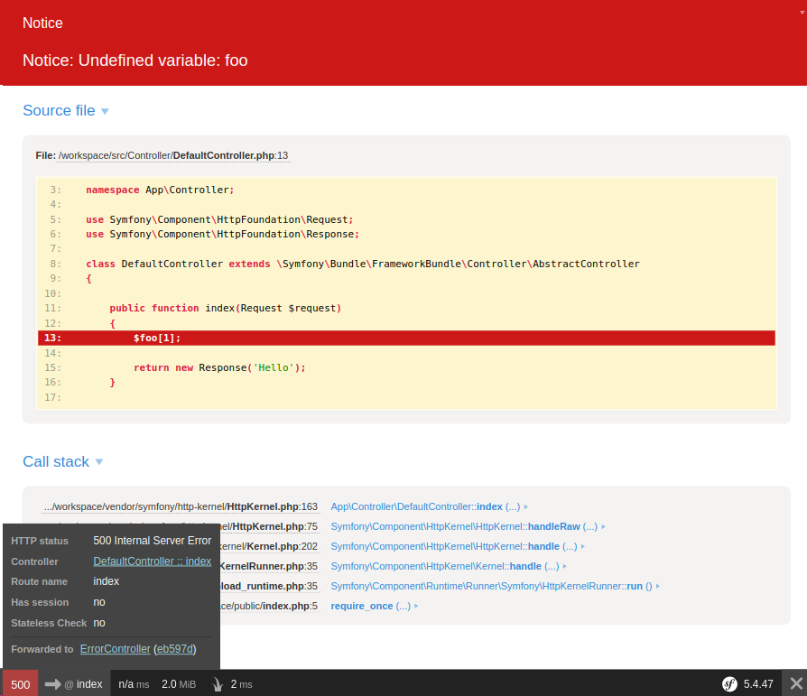
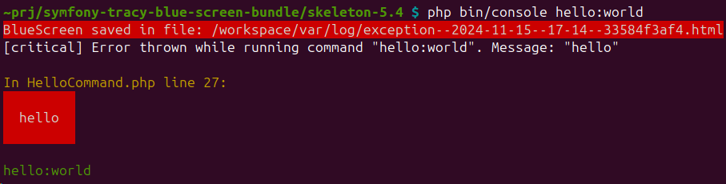

Tracy BlueScreen Bundle
======================

**This bundle lets you use the [Tracy's debug screen](https://github.com/nette/tracy#visualization-of-errors-and-exceptions) in combination with the the default profiler in your Symfony application.**

Why is Tracy's debug screen better than the Symfony default exception screen:

* You can browse all values of function call arguments.
* All information about the current request and environment.
* You can view all the information which is contained by the exception (e.g. private properties).
* Configurable links to files in stacktrace which can open directly in the IDE.
* Fullscreen layout providing more space for information.
* Look at the interactive [example screen](http://nette.github.io/tracy/tracy-exception.html).

However the Symfony profiler provides a lot of useful information about the application when an error occurs, so it is better to have them both available:



### Console integration

To provide the same comfort while using [Symfony Console](http://symfony.com/doc/current/components/console/introduction.html) this bundle will save a rendered BlueScreen to a file and show you a link for it. If you configure it, it will open the exception directly in your browser.



Usage
-----

If you do not have any custom `kernel.exception` listeners this works out of the box. However if you have any, you have to ensure that they do not return any response, because that prevents the profiler from showing up (the same applies for the default Symfony exception screen).

If you need to change the default position of this listener (see order in `app/console debug:event-dispatcher`), use the configuration option `listener_priority`.

This bundle expects that you are using the default Symfony profiler screen rendered via the [TwigBundle](http://symfony.com/doc/current/reference/configuration/twig.html), which must be registered.

Console integration also works out of the box, if you do not have an `console.exception` listener that would prevent execution of this one. Again, this can be tweaked using the respective `listener_priority` option.

Configure the `browser` option to open the exceptions directly in your browser, configured binary must be executable with [`exec()`](http://php.net/manual/en/function.exec.php).

If you want to configure your application to always convert warnings and notices to exceptions use the `debug.error_handler.throw_at` parameter (see [PHP manual](http://php.net/manual/en/errorfunc.constants.php) for other available values):
```yaml
parameters:
    debug.error_handler.throw_at: -1
```

This bundle does not provide a dedicated logging functionality. If you want to use Tracy for logging e.g. in production use the [monolog-extensions-bundle](https://github.com/pavelkucera/monolog-extensions-bundle/), which provides a Tracy Monolog handler.

Configuration
-------------

Configuration structure with listed default values:

```yaml
# app/config/config.yml
tracy_blue_screen:
    controller:
        # Enable debug screen for controllers.
        # Enabled by default only in dev environment with debug mode on.
        enabled: ~
        # Priority with which the listener will be registered.
        listener_priority: 0

    console:
        # Enable debug screen for console.
        # Enabled by default only in dev environment with debug mode on.
        enabled: ~

        # Directory, where BlueScreens for console will be stored.
        # If you are already using Tracy for logging, set this to the same.
        # This will be only used, if given Tracy\Logger instance does not have a directory set.
        log_directory: '%kernel.logs_dir%'

        # Configure this to open generated BlueScreen in your browser.
        # Configuration option may be for example 'google-chrome'
        # or 'firefox'and it will be invoked as a shell command.
        browser: null

        # Priority with which the listener will be registered.
        listener_priority: 0

    blue_screen:
        # Add paths which should be collapsed (for external/compiled code) so that actual error is expanded.
        collapse_paths:
            # Defaults:
            - %kernel.root_dir%/bootstrap.php.cache
            - %kernel.cache_dir%
            # plus paths set in BlueScreen instance used (/vendor)

```

You can also override services used internally, for example if you need to specify options for the BlueScreen instance, you can provide custom instance with an [alias](http://symfony.com/doc/current/components/dependency_injection/advanced.html#aliasing):

```yaml
services:
    my_blue_screen:
        class: Tracy\BlueScreen
        properties:
            info:
                - 'environment: %kernel.environment%'

    vasek_purchart.tracy_blue_screen.tracy.blue_screen: @my_blue_screen
```

Installation
-----------

Install package [`vasek-purchart/tracy-blue-screen-bundle`](https://packagist.org/packages/vasek-purchart/tracy-blue-screen-bundle) with [Composer](https://getcomposer.org/):

```bash
composer require vasek-purchart/tracy-blue-screen-bundle
```

Register the bundle in your application kernel:
```php
// app/AppKernel.php
public function registerBundles()
{
	return array(
		// ...
		new VasekPurchart\TracyBlueScreenBundle\TracyBlueScreenBundle(),
	);
}
```

